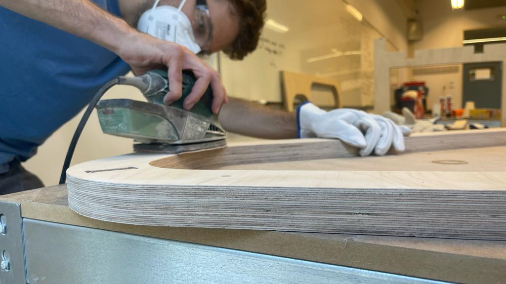

# About me

Hi, I’m Jorge Muñoz an industrial design engineer based on Barcelona currently taking the Master in Design for Emergent Futures program at IAAC. 
My purpose is to redefine the future of design by integrating innovative thinking, cutting-edge technology, and a deep commitment to sustainability. By immersing myself in a multidisciplinary and transformative learning environment, I aspire to hone my skills in emergent design methodologies, exploring the intersections of technology, ecology, and human experience.
With a profound passion for circular economy principles, I aim to create design solutions that not only meet the needs of the present but also preserve the resources for future generations. I am inspired to pioneer sustainable practices, forging new pathways in product design, manufacturing, and consumption patterns.
