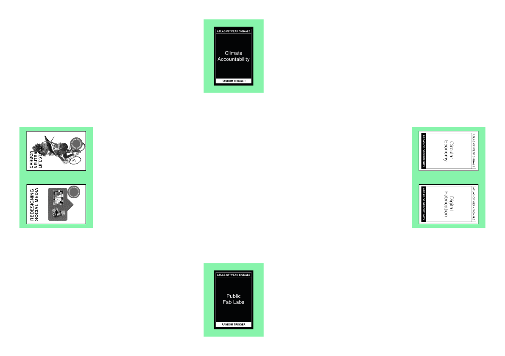

---
hide:
    - toc
---

# Atlas of Weak Signals

## Atlas of Weak Signals reflections

A weak signal can be seen as an early sign, hinting at future changes that might not have a significant impact at the moment but could potentially lead to major events down the line. These signals are pioneers, pointing towards emerging trends and the specific directions they’re heading, helping to anticipate the future. Essentially, they represent situations before they are widely recognized. Finding them and understanding them before they become “strong” is essential in future research. In order to detect them, we, the researchers of the future, should try to address the surrounding issues while pushing the boundaries between mainstream society and the future of technologies. 
To help researchers find these “weak” signals, José Luis de Vicente and Mariana Quintero created the Atlas of the Weak Signals, a card game that can be used as a tool to facilitate seeking opportunities, threats, challenges and shared visions for innovation, policymaking, intervention, research and business opportunities in the future.

 
https://fablabbcn.org/blog/emergent-ideas/atlas-of-weak-signals

## Atlas of Weak Signals group exercise

To properly understand how to find weak signals, we played the card game Boy Groups. My group, composed of Jorge de la Mora, Francisca and Ana started pulling out the refugee tech and the carbon-neutral lifestyle Weak Signals cards. Here we discussed how refugee camps like the one in Kutupalong in Cox's Bazar situated in Bangladesh, home to 880000 refugees, doesn’t have the resources to build first need products like water cleaners, gardens to cultivate food, and generators of electricity. Considering the political conditions that surround this type of camps, we thought a carbon-neutral approach to this problem would be a good kind of intervention. Trying to create products from scratch only using things that are accessible in this kind of camps. We also discussed the possibility of sending digital fabrication machines like 3D printers and how maker education will help repair and create useful things. Next up, we picked the Circular Economy and Supply Chain Innovation Areas of Opportunity cards. By adding this to the equation, we discussed the repairability of products nowadays and how we should, as consumers demand more easily reparable products, force companies to change the location of their production in order to create a more sustainable consumption process. We also discussed, how we could try to promote a more circular way of consuming by buying secondhand and supporting local businesses. Finally, we took out the Random Trigger cards. In this case, we chose microbiotic literacy and Neighborhood Fab Labs. These helped to dig deeper into the maker education previously mentioned and the repairability of products. Also helped us think about the building of our own products at the Fab Labs. This would also favor the principles of circular economy. We also discussed the education in microbiotics, that could be applied to the refugee camps already mentioned.

## My own Atlas of Weak Signals

### **First phase, Weak Signals**

_Pull out two WS cards //Redesigning Social Media \ Carbon Neutral Lifestyle//_

With these two cards, we can talk about how every day, thanks to social media, we’re more
connected to what’s happening globally. Maybe by using social media as a way to make people
more conscious of the problems of climate change and global capitalism and make them realize
the “power” that we all possess while being united, we can make big corporations change their
environmental approaches and offer more sustainable products.

### **Second phase, Areas of Opportunity**

_Pull out two AoO cards //Digital Fabrication \ Circular Economy//_

Adding these two new cards to the equation, we can now try to talk about how implementing
digital fabrication in everyday life can make people have a more sustainable approach
to consuming. Instead of buying a new chair at IKEA, for example, we can just buy locally
produced wood and cut the pieces to assemble one with a router CNC in a workshop next to
home. That way, we reduce the impact of buying a chair, and we favor the principles of the
circular economy. Also, social media can be used to share open-source models of furniture and
other things that people might need to manufacture locally.

### **Third phase, Random Trigger**

_Pull out two RT cards //Neighbourhood Fab Labs \ Plastic Digestion//_

Finally, with these two last cards, we can try and relate the whole thing: to achieve a more
sustainable way of consuming, using less plastic and following the principles of the circular
economy, we can try to promote buying products locally. Artisan products embody the
term “sustainable, being produced locally and mostly with locally and sustainably produced
materials. The problem with artisan products is that most of them are expensive because of
the way they’re manufactured. By teaching artisans how to implement digital fabrication thanks
to the Fab Labs close to them, the manufacturing process of their products will be drastically
reduced. Adding to this an intense social media campaign promoting buying local as well as
courses to study and implement digital fabrication so artisans can easily reach them, we might
be able to change the approach to consumption.

### **Initial board**

### **My Multiscalar Personal Design Space**

### **My Design Space**

